# Gesture Bridge - 개발중 ~05.22

웹캠과 마이크를 입력 장치로 사용해 `PC 제어`, `수화 문장 인식`, `인터랙티브 제스처/음성 체험`을 하나의 프로젝트 안에서 다루는 멀티모달 인터랙션 시스템입니다.

기존 `signlanguageProject`라는 이름은 수화 기능만 떠올리게 해서 현재 범위를 충분히 설명하지 못합니다. 이 저장소는 손동작, 수화 gloss, 한국어 음성 명령, 웹 인터랙션을 연결하는 프로젝트이므로 `Gesture Bridge`를 공식 이름으로 사용합니다.

<p align="center">
  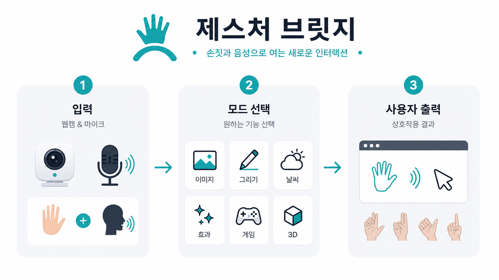
</p>

## 목차

- [프로젝트 핵심](#프로젝트-핵심)
- [기능 한눈에 보기](#기능-한눈에-보기)
- [빠른 실행](#빠른-실행)
- [전체 작동 구조](#전체-작동-구조)
- [모드별 상세 설명](#모드별-상세-설명)
- [수화 문장 인식 데이터셋과 한계](#수화-문장-인식-데이터셋과-한계)
- [폴더 구조](#폴더-구조)
- [주요 명령어](#주요-명령어)
- [개발과 검증](#개발과-검증)
- [GitHub 저장소 이름 변경](#github-저장소-이름-변경)

## 프로젝트 핵심

Gesture Bridge는 같은 카메라 입력에서 출발하지만 목적이 다른 기능을 명확히 분리합니다.

| 영역 | 목적 | 실행 위치 | 주요 입력 | 주요 출력 |
| --- | --- | --- | --- | --- |
| PC 제어 | 손동작으로 실제 화면을 조작 | Python/OpenCV | 웹캠 손 랜드마크 | 마우스 이동, 클릭, 스크롤, 슬라이드 넘김 |
| 수화 문장 | 양손과 팔 동작을 gloss 토큰으로 인식하고 한국어 문장으로 조립 | Python/OpenCV/ML | 웹캠 양손 + 팔 포즈 | gloss 토큰, 한국어 문장 후보 |
| 인터랙티브 체험 | 한국어 음성과 손동작으로 사진, 그림, 효과, 게임, 음악, 3D를 조작 | Next.js 웹앱 | 웹캠 손 추적, 마이크 음성, 마우스 시뮬레이션 | 브라우저 기반 체험 UI |

중요한 전제:

- 수화 문장 모드는 현재 `영상에서 바로 완전한 문장을 번역하는 end-to-end 대형 모델`이 아닙니다.
- 현재 구조는 `랜드마크 기반 sign/gloss 인식 -> 안정화된 gloss 토큰 누적 -> GKSL 문장 메모리 exact/fuzzy 매칭 -> 한국어 문장 출력` 방식입니다.
- 단어 기반 출력은 백업으로 유지되어 있으며 `--output-mode words`로 사용할 수 있습니다.
- 문장 품질은 실제로 수집하고 학습한 gloss 라벨 범위에 따라 달라집니다.
- 인터랙티브 체험은 실제 카메라가 없어도 마우스 시뮬레이션으로 기능 대부분을 확인할 수 있습니다.

## 기능 한눈에 보기

### 1. PC 제어

- 검지만 펴기: 커서 이동
- 엄지와 검지 붙이기: 클릭
- 브이 표시: 다음 슬라이드
- 엄지 위/아래: 스크롤
- 안정화 window와 cooldown으로 오작동을 줄임
- 기본은 dry-run이며 `--live`를 붙여야 실제 OS 입력이 실행됨

### 2. 수화 문장 인식

- 양손 랜드마크와 팔 포즈를 함께 사용
- 라벨별 landmark sequence 수집
- KNN baseline 모델 학습
- 안정화된 예측을 gloss 토큰으로 누적
- GKSL gloss-to-Korean 문장 메모리로 한국어 문장 후보 출력
- GKSL, KSL-LEX 기반 확장 라벨 설정 생성 지원
- AI Hub/NIKL처럼 승인 필요한 데이터셋은 직접 받은 뒤 import 가능

### 3. 인터랙티브 체험 웹앱

브라우저에서 `/interactive`로 실행되는 체험형 UI입니다.

- 사진 모드: floating image 표시, 손/마우스로 이동, 확대/축소, 다음/이전
- 그림 모드: 손가락/마우스로 공중 드로잉, 펜, 지우개, 색상, 굵기, undo, 저장
- 날씨 모드: 한국어 음성 명령으로 날씨 패널 표시, API fallback 구조 포함
- 효과 모드: 포탈, 방어막, 입자 폭발, 레이저, 물결, 바람, 화염 등 original effect
- 게임 모드: 낙하물 받기, 버블 터뜨리기, Pong, 회피, 슬라이스, 던지기, 반응, 리듬, 타깃
- 3D 모드: 손 포인터 기반 3D 오브젝트 회전/스케일 체험
- 음악 모드: 재생, 멈춤, 음소거, 볼륨 조절, 시각화
- 설정/도움말: 한국어 음성 명령 예시와 제스처 상태 확인

## 이미지로 보는 구조

### 1. 처음 화면의 세 가지 입구

<p align="center">
  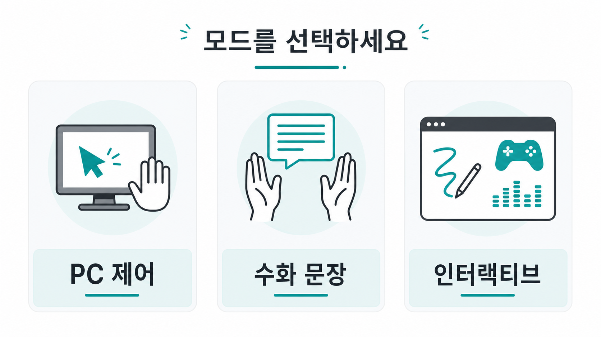
</p>

### 2. Python 런타임 흐름

<p align="center">
  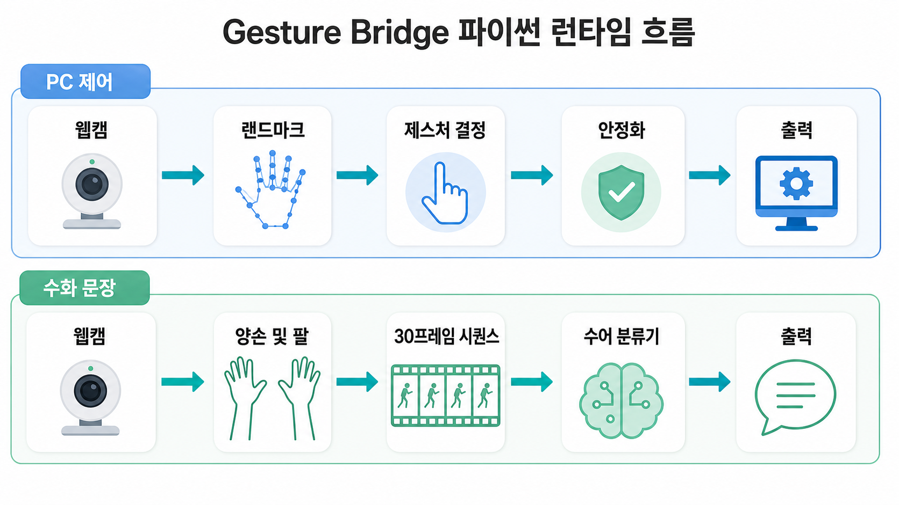
</p>

### 3. 수화 문장 인식 파이프라인

<p align="center">
  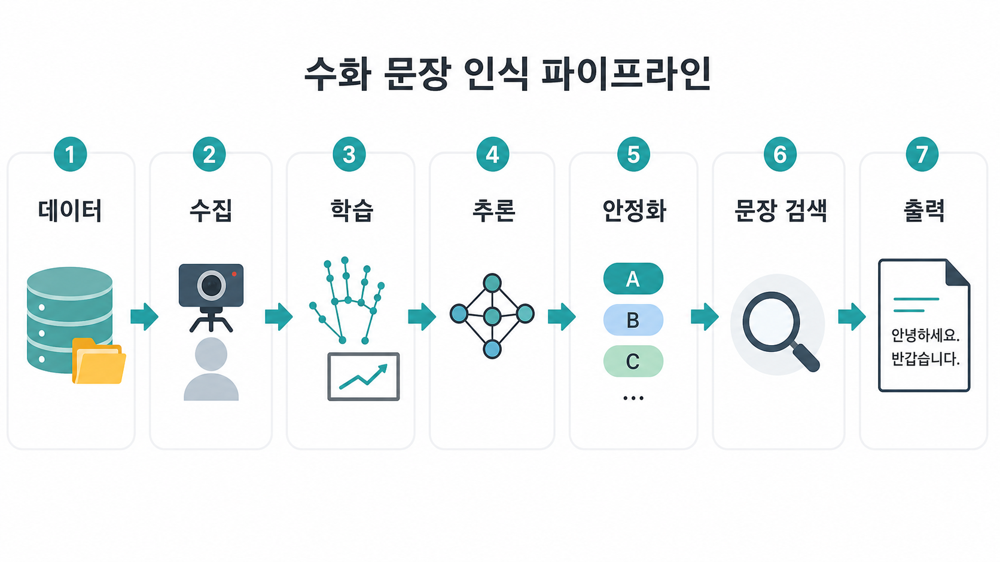
</p>

### 4. 인터랙티브 웹 스테이지 구조

<p align="center">
  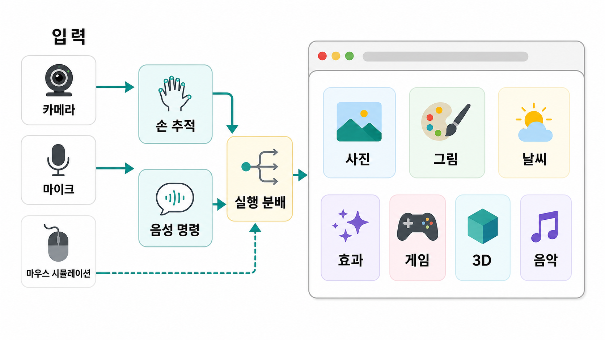
</p>

### 5. 코드 구조 지도

<p align="center">
  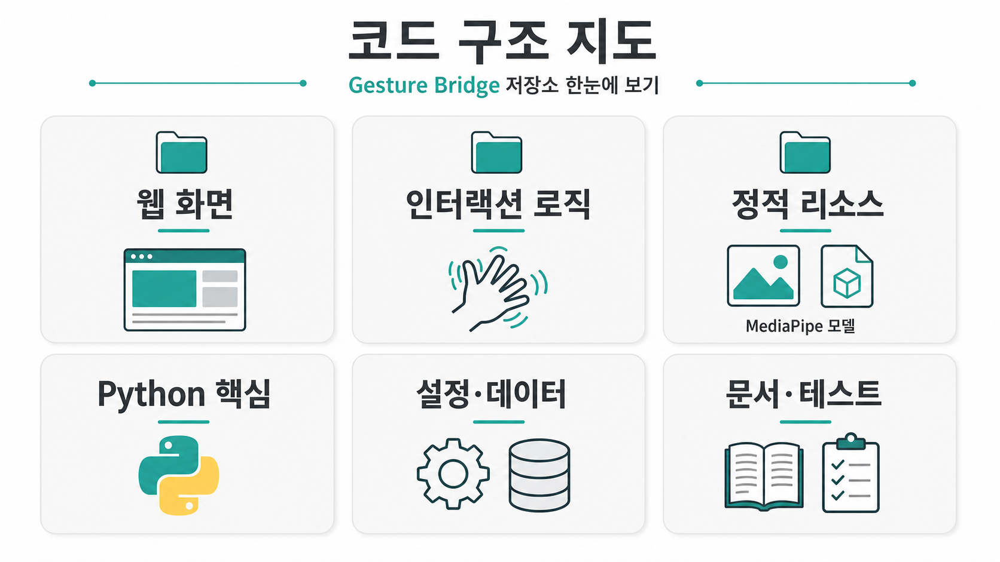
</p>

### 6. 데이터셋과 문장 리소스 흐름

<p align="center">
  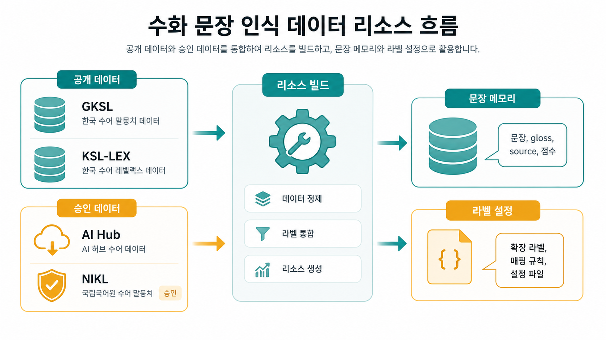
</p>

### 7. 자주 쓰는 실행 명령

<p align="center">
  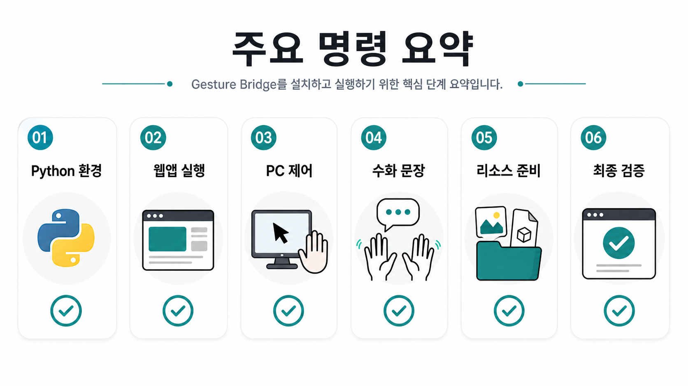
</p>

### 8. 제스처와 한국어 명령 처리 흐름

<p align="center">
  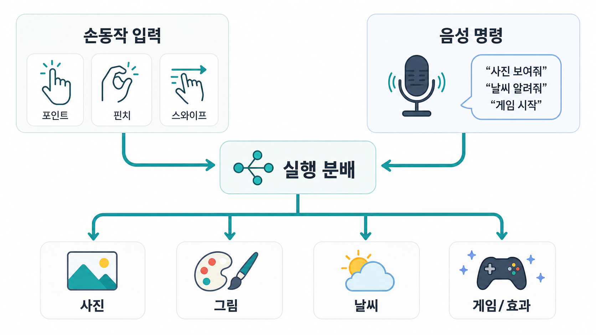
</p>

## 빠른 실행

### 1. Python 환경 준비

```bash
cd gesture-bridge
python -m venv .venv
source .venv/bin/activate
pip install -e ".[vision,control,ml,dev]"
```

이미 가상환경을 만든 뒤에는 작업할 때마다 아래만 실행하면 됩니다.

```bash
cd gesture-bridge
source .venv/bin/activate
```

현재 로컬 폴더명이 아직 `signlanguageProject`라면 `cd /Users/suhwan/Downloads/signlanguageProject`를 사용해도 됩니다.

### 2. 프론트엔드 환경 준비

이 프로젝트의 웹앱은 Next.js 기반입니다.

```bash
pnpm install --frozen-lockfile
pnpm dev
```

브라우저에서 다음 주소를 엽니다.

```text
http://127.0.0.1:3000
```

production 빌드 확인:

```bash
pnpm build
pnpm start --hostname 127.0.0.1 --port 3001
```

### 3. 가장 먼저 확인할 명령

실제 마우스나 키보드를 움직이지 않는 PC 제어 dry-run입니다.

```bash
PYTHONPATH=src python -m gesture_bridge pc-control
```

실제 OS 입력을 내보내려면 명시적으로 `--live`를 붙입니다.

```bash
PYTHONPATH=src python -m gesture_bridge pc-control --live
```

### 4. 인터랙티브 체험 바로 열기

```bash
pnpm dev
```

```text
http://127.0.0.1:3000/interactive
```

카메라 권한이 없거나 테스트 환경이라면 `마우스 시뮬레이션` 버튼으로 포인터/클릭 제스처를 대신 사용할 수 있습니다.

## 전체 작동 구조

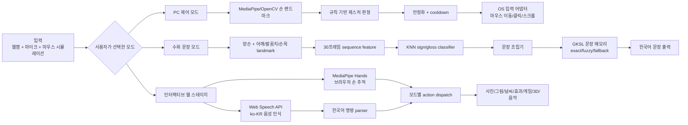

### 수화 문장 파이프라인

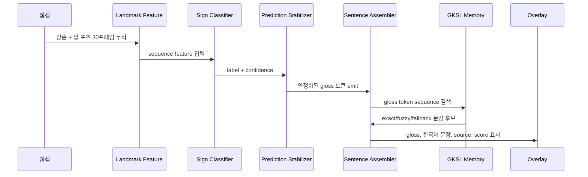

### 인터랙티브 웹 스테이지

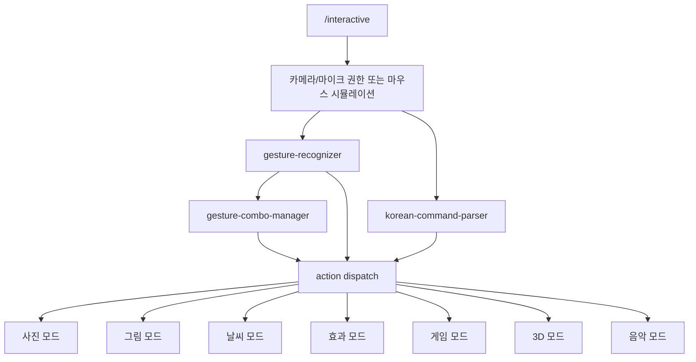

## 모드별 상세 설명

### PC 제어 모드

PC 제어 모드는 한 손의 정적인 제스처를 빠르게 판정해 실제 화면 조작으로 연결합니다.

| 손동작 | 내부 이름 | 동작 |
| --- | --- | --- |
| 손바닥 펴기 | `open_palm` | 대기 |
| 검지만 펴기 | `point` | 커서 이동 |
| 엄지와 검지 붙이기 | `pinch` | 왼쪽 클릭 |
| 브이 | `peace` | 다음 슬라이드 |
| 엄지 올리기 | `thumbs_up` | 위로 스크롤 |
| 엄지 내리기 | `thumbs_down` | 아래로 스크롤 |

실행:

```bash
PYTHONPATH=src python -m gesture_bridge pc-control
PYTHONPATH=src python -m gesture_bridge pc-control --live
```

카메라 확인:

```bash
PYTHONPATH=src python -m gesture_bridge probe-camera
```

카메라가 여러 개면 읽히는 조합을 직접 지정합니다.

```bash
PYTHONPATH=src python -m gesture_bridge pc-control --camera-index 1 --camera-backend default
```

### 수화 문장 모드

수화 문장 모드는 두 단계로 나뉩니다.

1. 카메라 입력에서 landmark sequence를 기반으로 sign/gloss label을 인식
2. 인식된 gloss token sequence를 한국어 문장으로 조립

기본 실행:

```bash
PYTHONPATH=src python -m gesture_bridge sign-text \
  --labels-config configs/korean_sentence_gloss_labels.example.json
```

기존 단어 출력 백업:

```bash
PYTHONPATH=src python -m gesture_bridge sign-text \
  --labels-config configs/korean_sign_labels.example.json \
  --output-mode words
```

문장과 단어를 같이 보고 싶을 때:

```bash
PYTHONPATH=src python -m gesture_bridge sign-text \
  --labels-config configs/korean_sentence_gloss_labels.example.json \
  --output-mode both
```

라벨 수집 예시:

```bash
PYTHONPATH=src python -m gesture_bridge collect-signs \
  --labels-config configs/korean_sentence_gloss_labels.example.json \
  --label 집 \
  --sequences 30
```

학습:

```bash
PYTHONPATH=src python -m gesture_bridge train-signs \
  --labels-config configs/korean_sentence_gloss_labels.example.json
```

카메라 없이 gloss-to-Korean 계층만 테스트:

```bash
PYTHONPATH=src python -m gesture_bridge translate-gloss 집 불
```

예상 출력:

```text
Gloss:
집 불
Korean sentence:
집에 불이 났어요.
Source: exact:GKSL3k_original.csv, score=1.00, matched_gloss=집 불
```

### 인터랙티브 체험 모드

인터랙티브 모드는 브라우저에서 실행됩니다.

```bash
pnpm dev
```

```text
http://127.0.0.1:3000/interactive
```

대표 한국어 음성 명령:

| 명령 예시 | 동작 |
| --- | --- |
| `날씨 알려줘` | 날씨 모드로 이동 |
| `서울 날씨 알려줘` | 서울 날씨 패널 표시 |
| `사진 보여줘` | 사진 모드 |
| `다음 사진` | 다음 사진 선택 |
| `이전 사진` | 이전 사진 선택 |
| `확대해줘` | 선택 사진 확대 |
| `축소해줘` | 선택 사진 축소 |
| `그림 그리기 시작` | 그림 모드 |
| `지우개` | 지우개 도구 |
| `전체 지워줘` | 드로잉 전체 삭제 |
| `저장해줘` | 그림 저장 |
| `효과 실행` | 현재 효과 실행 |
| `게임 시작` | 게임 모드 |
| `3D 보여줘` | 3D 모드 |
| `음악 재생` | 음악 재생 |
| `음악 멈춰` | 음악 정지 |
| `볼륨 올려줘` | 볼륨 증가 |
| `초기화해줘` | 전체 상태 초기화 |

브라우저 음성 인식은 Web Speech API를 사용합니다. Chrome 계열 브라우저에서 가장 안정적으로 동작합니다.

## 수화 문장 인식 데이터셋과 한계

현재 프로젝트에 반영된 공개 리소스:

| 리소스 | 용도 | 저장 위치 | 비고 |
| --- | --- | --- | --- |
| GKSL-dataset | gloss sentence -> Korean sentence 메모리 | `data/external/gksl` | 공개 GitHub CSV |
| KSL-LEX | 한국수어 어휘 후보 확장 | `data/external/ksl_lex/KSL-LEX.csv` | Hugging Face dataset viewer |
| KSL-Guide README | sentence dataset reference | `data/external/ksl_guide/README.md` | 실제 원본 데이터는 AI Hub 승인 필요 |
| Local imported corpus | 승인 후 직접 받은 AI Hub/NIKL 자료 import | `data/external/local_sentence_corpus` | 사용자가 직접 다운로드 후 import |

리소스 갱신:

```bash
PYTHONPATH=src python -m gesture_bridge prepare-sentence-resources --max-labels 160
```

개별 실행:

```bash
PYTHONPATH=src python -m gesture_bridge download-sentence-data
PYTHONPATH=src python -m gesture_bridge download-ksl-lex
PYTHONPATH=src python -m gesture_bridge build-sentence-model
PYTHONPATH=src python -m gesture_bridge build-sentence-labels --max-labels 160
```

AI Hub/NIKL에서 승인 후 받은 말뭉치를 import:

```bash
PYTHONPATH=src python -m gesture_bridge import-sentence-corpus /path/to/extracted/ksl-corpus
```

import한 데이터까지 문장 메모리에 포함:

```bash
PYTHONPATH=src python -m gesture_bridge build-sentence-model \
  --csv data/external/gksl/GKSL3k_original.csv \
        data/external/gksl/GKSL13k_augmented.csv \
        data/external/local_sentence_corpus/imported_sentence_pairs.csv
```

주의:

- GKSL 공개 데이터 라이선스는 `CC BY-NC-SA 4.0`입니다.
- 상업적 사용 전에는 반드시 데이터 라이선스와 원본 제공처 조건을 확인해야 합니다.
- `configs/korean_sentence_gloss_labels.expanded.json`는 후보 라벨 목록입니다. 이 파일이 있다고 해서 해당 라벨을 카메라가 바로 인식하는 것은 아닙니다.
- 실제 인식을 위해서는 각 라벨별 landmark sequence를 수집하고 `train-signs`로 모델을 다시 학습해야 합니다.

## 폴더 구조

```text
gesture-bridge/
├── app/                         # Next.js App Router 페이지
│   ├── page.tsx                 # 기능 선택 랜딩
│   └── interactive/page.tsx     # 인터랙티브 체험 진입점
├── components/
│   ├── interactive/             # 인터랙티브 스테이지 React UI
│   └── ui/                      # shadcn 기반 공용 UI 컴포넌트
├── lib/interactive/
│   ├── features/                # 효과, 미니게임 정의
│   ├── gesture/                 # 브라우저 제스처 인식과 콤보
│   ├── services/                # 날씨 등 외부 서비스 계층
│   ├── voice/                   # 한국어 음성 명령 parser
│   └── types.ts                 # 인터랙티브 모드/명령 타입
├── public/
│   ├── models/hand_landmarker.task
│   ├── mediapipe/wasm/          # 브라우저 MediaPipe runtime
│   └── *.png                    # 랜딩/README용 이미지
├── src/gesture_bridge/
│   ├── control/                 # PC 제어 gesture/action mapping
│   ├── core/                    # 카메라, landmark, feature, overlay, download 유틸
│   ├── modes/                   # pc_control, sign_text 실행 모드
│   └── sign/                    # sign classifier, dataset, sentence resources
├── configs/                     # gesture action, sign label 설정
├── data/external/               # 공개/사용자 import 데이터
├── models/                      # 학습 모델과 문장 메모리
├── docs/                        # 연구 메모와 README 이미지
└── tests/                       # Python 테스트
```

## 주요 명령어

### 프로젝트 구조 확인

```bash
PYTHONPATH=src python -m gesture_bridge overview
PYTHONPATH=src python -m gesture_bridge roadmap
PYTHONPATH=src python -m gesture_bridge tree
```

### 카메라

```bash
PYTHONPATH=src python -m gesture_bridge probe-camera
```

### PC 제어

```bash
PYTHONPATH=src python -m gesture_bridge pc-control
PYTHONPATH=src python -m gesture_bridge pc-control --live
```

### 수화 데이터 수집/학습/추론

```bash
PYTHONPATH=src python -m gesture_bridge collect-signs --label 안녕하세요 --labels-config configs/korean_sign_labels.example.json
PYTHONPATH=src python -m gesture_bridge train-signs --labels-config configs/korean_sign_labels.example.json
PYTHONPATH=src python -m gesture_bridge sign-text --labels-config configs/korean_sign_labels.example.json
```

### 문장 리소스

```bash
PYTHONPATH=src python -m gesture_bridge prepare-sentence-resources --max-labels 160
PYTHONPATH=src python -m gesture_bridge translate-gloss 집 불
```

### 프론트엔드

```bash
pnpm dev
pnpm lint
pnpm exec tsc --noEmit
pnpm build
pnpm start --hostname 127.0.0.1 --port 3001
```

## 개발과 검증

최종 검증 시 사용한 명령:

```bash
pnpm install --frozen-lockfile
pnpm peers check
pnpm lint
pnpm exec tsc --noEmit
pnpm build

PYTHONPATH=src .venv/bin/pytest -q
PYTHONPATH=src .venv/bin/ruff check src tests
PYTHONPATH=src .venv/bin/python -m compileall -q src tests
PYTHONPATH=src .venv/bin/python -m gesture_bridge translate-gloss 집 불
PYTHONPATH=src .venv/bin/python -m gesture_bridge build-sentence-labels --max-labels 160 --output-path /tmp/korean_sentence_gloss_labels.check.json
```

브라우저 QA는 Playwright로 다음을 확인했습니다.

- `/` 랜딩 렌더링
- `/interactive` 데스크톱 렌더링
- `/interactive` 모바일 렌더링
- 그림 모드 마우스 시뮬레이션 드로잉
- fake media 기반 카메라 시작 흐름
- 콘솔 에러, 페이지 에러, 실패 request 여부

## 구현 메모

### 프론트엔드

- Next.js 15 App Router 기반
- React 19 사용
- MediaPipe Tasks Vision으로 브라우저 손 추적
- Web Speech API `ko-KR` 기반 한국어 음성 명령 인식
- Canvas API로 드로잉, 효과, 미니게임 렌더링
- Three.js 의존성은 3D 기능 확장 기반으로 유지
- `/interactive`는 카메라 권한이 없어도 마우스 시뮬레이션으로 대부분 기능을 검증 가능

### Python

- OpenCV + MediaPipe 기반 카메라 처리
- PC 제어는 dry-run 기본값으로 안전하게 설계
- 실제 OS 제어는 `--live`를 명시해야 실행
- 수화 문장 계층은 데이터 다운로드, 말뭉치 import, 문장 메모리 build, 라벨 config build를 CLI로 분리
- 다운로드는 임시 파일에 받은 뒤 replace하는 원자적 저장 방식 사용

## GitHub 저장소 이름 변경

현재 remote는 기존 이름을 가리킵니다.

```text
https://github.com/luckyandy7/signlanguageProject.git
```

GitHub 저장소 이름을 `gesture-bridge`로 바꾼 뒤 remote를 아래처럼 변경합니다.

```bash
git remote set-url origin https://github.com/luckyandy7/gesture-bridge.git
git remote -v
```

GitHub CLI로 저장소 이름까지 같이 바꿀 수 있는 환경이면:

```bash
gh repo rename gesture-bridge --repo luckyandy7/signlanguageProject
git remote set-url origin https://github.com/luckyandy7/gesture-bridge.git
```

그 다음 push:

```bash
git push -u origin main
```

브랜치 이름이 `master`라면:

```bash
git push -u origin master
```

## 권장 작업 순서

1. README와 코드 변경 확인
2. GitHub repo 이름을 `gesture-bridge`로 변경
3. `git remote set-url origin https://github.com/luckyandy7/gesture-bridge.git`
4. 검증 명령 재실행
5. commit
6. push

## 라이선스와 데이터 주의사항

코드 라이선스는 아직 저장소에 명시되어 있지 않습니다. 공개 배포 전에는 `LICENSE` 파일을 추가하는 것이 좋습니다.

데이터는 코드와 별개로 원본 제공처의 라이선스를 따릅니다. 특히 GKSL 공개 데이터는 `CC BY-NC-SA 4.0` 조건이므로 상업적 사용이나 재배포 계획이 있다면 반드시 별도 검토가 필요합니다.
