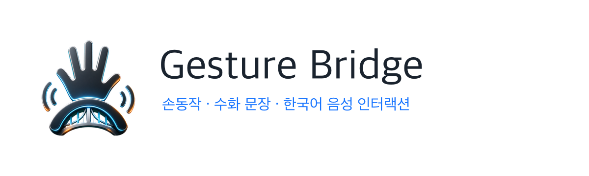
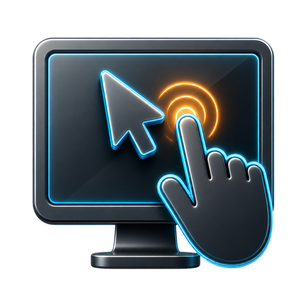
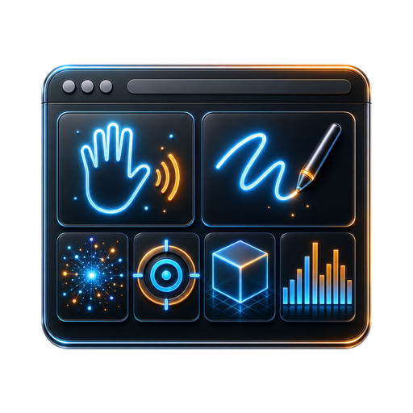

# Gesture Bridge 브랜드 키트

Gesture Bridge는 손동작, 수화 문장, 한국어 음성 명령을 하나의 인터랙션 경험으로 연결하는 프로젝트입니다. 브랜드 이미지는 메인 랜딩의 유동적인 블루/오렌지 shader 배경에 맞춰 `손`, `브리지`, `음성 파동`, `카메라 기반 인터페이스`를 핵심 상징으로 잡았습니다.

  

## 브랜드 방향

- **핵심 이미지**: 손바닥 위를 지나가는 브리지 아크와 양쪽 음성 파동
- **시각 톤**: 메인 랜딩의 전기 블루, 앰버 오렌지, 실버 하이라이트, 낮은 채도의 그래파이트 글래스
- **사용 감각**: 미래형 인터페이스처럼 보이되, 설명 화면과 실행 화면에서 과하게 장식적이지 않게 유지
- **텍스트 원칙**: 생성 이미지 안에는 문자를 넣지 않고, 제품명과 설명 문구는 HTML/CSS 또는 문서 텍스트로 렌더링

## 색상

| 역할 | 색상 | 용도 |
| --- | --- | --- |
| Graphite Black | `#071015` | 인터랙션 화면 배경, 앱 아이콘 바탕 |
| Deep Panel | `#0F2026` | 카드, 패널, 이미지 프레임 |
| Landing Blue | `#0066FF` | 메인 랜딩 shader, 주요 발광선 |
| Signal Blue | `#1275D8` | 손 추적선, 링크, 포커스 |
| Amber Flow | `#E19136` | 랜딩 shader의 반대편 흐름, 클릭/강조 포인트 |
| Silver Light | `#D1D1D1` | 금속성 테두리, 중립 하이라이트 |
| Soft White | `#F2FAFA` | 어두운 배경 위 본문/로고 텍스트 |

## 로고 자산

| 자산 | 파일 | 권장 사용처 |
| --- | --- | --- |
| 브랜드 마크 | `public/brand/gesture-bridge-mark.png` | 내비게이션, 헤더, 작은 브랜드 표식 |
| 브랜드 마크 512 | `public/brand/gesture-bridge-mark-512.png` | 작은 UI, README, 빠른 로딩이 필요한 곳 |
| 앱 아이콘 1024 | `public/brand/gesture-bridge-app-icon.png` | 고해상도 앱/프로필 이미지 |
| 앱 아이콘 512 | `public/brand/gesture-bridge-app-icon-512.png` | 파비콘 원본, 문서용 아이콘 |
| 다크 로고 락업 | `public/brand/gesture-bridge-lockup-dark.png` | 어두운 README 배너, 다크 배경 |
| 라이트 로고 락업 | `public/brand/gesture-bridge-lockup-light.png` | 흰 배경 문서, 발표 자료 |
| 브랜드 배너 | `public/brand/gesture-bridge-banner.png` | README 상단, 오픈그래프 공유 이미지 |

## 모드 아이콘

  
  
  

| 모드 | 파일 | 의미 |
| --- | --- | --- |
| PC 제어 | `public/brand/mode-pc-control.png` | 손 포인터가 실제 화면 제어로 이어지는 기능 |
| 수화 문장 | `public/brand/mode-sign-sentence.png` | 양손 랜드마크와 문장 패널을 통한 한국어 문장화 |
| 인터랙티브 스테이지 | `public/brand/mode-interactive-stage.png` | 사진, 드로잉, 효과, 게임, 3D, 음악을 묶은 체험형 웹 UI |

## 사용 규칙

- 작은 헤더와 버튼에는 `*-512.png` 버전을 우선 사용합니다.
- 랜딩 카드나 상세 카드처럼 큰 영역에는 768px 버전인 `mode-*.png`를 사용할 수 있습니다.
- 생성형 로고 안에 텍스트를 직접 넣지 않습니다. 프로젝트명은 DOM 텍스트로 렌더링하거나 제공된 락업 이미지를 사용합니다.
- 브랜드 마크 주변에는 마크 높이의 최소 20% 이상 여백을 둡니다.
- 배경이 밝으면 `gesture-bridge-lockup-light.png`, 배경이 어두우면 `gesture-bridge-lockup-dark.png`를 사용합니다.
- 기능 버튼의 작은 조작 아이콘은 사용성 때문에 기존 Lucide 아이콘을 유지하고, 브랜드/모드 식별 아이콘만 생성 PNG를 사용합니다.

## 프론트 반영 위치

| 화면 | 반영 내용 |
| --- | --- |
| `app/page.tsx` | 홈 내비게이션 로고, 세 가지 모드 카드 아이콘, 모드 상세 아이콘 |
| `components/interactive/InteractiveExperience.tsx` | 인터랙티브 스테이지 헤더 브랜드 마크 |
| `app/layout.tsx` | PNG 파비콘, Apple icon, OpenGraph 배너 |
