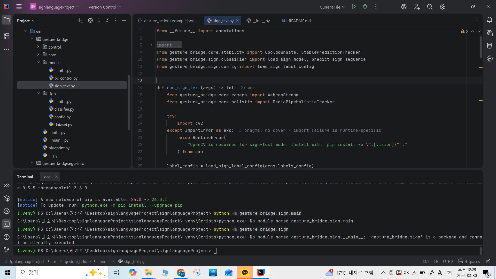

# Gesture Bridge

웹캠으로 손동작을 인식해서 두 가지 모드로 동작하는 프로젝트다.

- `PC 제어 모드`: 손동작으로 마우스 이동, 클릭, 스크롤, 슬라이드 넘기기
- `수화 텍스트 모드`: `두 손 + 팔(포즈)` 정보를 같이 보고 제한된 수화 단어를 인식해서 텍스트로 출력

중요한 점:

- 이 프로젝트는 `문장 단위 전체 수화 번역기`가 아니다
- 현재 수화 모드는 `미리 정한 단어 몇 개`를 인식하는 구조다
- 먼저 `PC 제어 모드`를 확인하고, 그다음 `수화 데이터 수집 -> 학습 -> 추론` 순서로 쓰는 게 맞다
- 수화 모드는 현재 `양손과 팔 동작`까지 반영하도록 구성되어 있다

## 1. 처음 한 번만 해야 하는 설치

프로젝트 폴더에서 아래 순서대로 실행한다.

```bash
cd /Users/suhwan/Downloads/signlanguageProject
python -m venv .venv
source .venv/bin/activate
pip install -e ".[vision,control,ml]"
```

설치가 끝났으면 이후부터는 작업할 때마다 아래만 먼저 실행하면 된다.

```bash
cd /Users/suhwan/Downloads/signlanguageProject
source .venv/bin/activate
```

## 2. 빠른 실행

### 2-1. 화면 제어 바로 실행

드라이런:

```bash
cd /Users/suct
source .venv/bin/activate
PYTHONPATH=src python -m gesture_bridge pc-control
```

실제 마우스/키보드 제어:

```bash
cd /Users/suhwan/Downloads/signlanguageProject
source .venv/bin/activate
PYTHONPATH=src python -m gesture_bridge pc-control --live
```

### 2-2. 수어 인식 바로 실행

이미 학습이 끝난 상태라면 바로 추론:

```bash
cd /Users/suhwan/Downloads/signlanguageProject
source .venv/bin/activate
PYTHONPATH=src python -m gesture_bridge sign-text --labels-config configs/korean_sign_labels.example.json
```

아직 학습 전이라면 순서:

```bash
cd /Users/suhwan/Downloads/signlanguageProject
source .venv/bin/activate

PYTHONPATH=src python -m gesture_bridge collect-signs --labels-config configs/korean_sign_labels.example.json --label 안녕하세요 --sequences 30
PYTHONPATH=src python -m gesture_bridge collect-signs --labels-config configs/korean_sign_labels.example.json --label 감사합니다 --sequences 30
PYTHONPATH=src python -m gesture_bridge collect-signs --labels-config configs/korean_sign_labels.example.json --label 네 --sequences 30
PYTHONPATH=src python -m gesture_bridge collect-signs --labels-config configs/korean_sign_labels.example.json --label 아니요 --sequences 30

PYTHONPATH=src python -m gesture_bridge train-signs --labels-config configs/korean_sign_labels.example.json
PYTHONPATH=src python -m gesture_bridge sign-text --labels-config configs/korean_sign_labels.example.json
```

## 3. 이 프로젝트에서 제일 먼저 해볼 것

가장 먼저 아래 명령으로 `PC 제어 드라이런`을 실행한다.

```bash
PYTHONPATH=src python -m gesture_bridge pc-control
```

이 명령은 `실제 마우스/키보드를 움직이지 않고`, 화면에서 어떤 손동작이 어떤 동작으로 인식되는지만 보여준다.

현재 이 컴퓨터 기준 기본값:

- 카메라 인덱스: `1`
- 카메라 백엔드: `default`

즉, 지금은 옵션 없이 위 명령만 쳐도 되게 맞춰둔 상태다.

## 4. PC 제어 모드에서 손동작별 기능

현재 기본 제스처는 아래와 같다.

| 손동작 | 인식 이름 | 실행 동작 |
| --- | --- | --- |
| 손바닥 전체 펴기 | `open_palm` | 아무 동작 안 함, 대기 상태 |
| 검지만 펴기 | `point` | 마우스 커서 이동 |
| 엄지와 검지를 붙이기 | `pinch` | 왼쪽 클릭 |
| 브이 표시 | `peace` | 다음 슬라이드 |
| 엄지 올리기 | `thumbs_up` | 위로 스크롤 |
| 엄지 내리기 | `thumbs_down` | 아래로 스크롤 |

화면에서 볼 수 있는 텍스트 의미:

- `Gesture`: 안정화까지 끝난 최종 제스처
- `Raw`: 방금 프레임에서 원시적으로 감지된 제스처
- `Action`: 실제 실행되거나 실행될 동작

즉 `Raw`는 잠깐 흔들릴 수 있고, `Gesture`가 최종 결과라고 보면 된다.

## 5. PC 제어 모드 실행 방법

### 5-1. 안전 확인용 드라이런

```bash
PYTHONPATH=src python -m gesture_bridge pc-control
```

이 상태에서는 실제 마우스가 움직이지 않는다.

확인할 것:

- 카메라 창이 뜨는지
- 손 위에 랜드마크 선이 그려지는지
- `Gesture`, `Action` 텍스트가 바뀌는지

종료는 `q` 키다.

### 5-2. 실제 PC 제어 실행

```bash
PYTHONPATH=src python -m gesture_bridge pc-control --live
```

이 모드에서는 실제 마우스와 키보드 입력이 나간다.

주의:

- macOS에서는 접근성 권한이 필요할 수 있다
- 클릭과 스크롤이 실제로 실행되므로 처음에는 천천히 테스트하는 게 좋다

### 5-3. 카메라가 이상할 때

카메라가 안 잡히거나 다른 카메라가 켜지면 아래 명령으로 어떤 카메라가 읽히는지 확인한다.

```bash
PYTHONPATH=src python -m gesture_bridge probe-camera
```

결과에서 `readable=True`인 조합을 쓰면 된다.

예시:

```bash
PYTHONPATH=src python -m gesture_bridge pc-control --camera-index 1 --camera-backend default
```

## 6. 수화 텍스트 모드 사용 순서

수화 모드는 아래 순서로 사용한다.

1. 라벨 하나씩 데이터 수집
2. 수집한 데이터로 모델 학습
3. 학습된 모델로 실시간 추론

현재 수화 모드가 보는 정보:

- 왼손 랜드마크
- 오른손 랜드마크
- 어깨, 팔꿈치, 손목 위치

즉 단순히 `손 하나`만 보는 구조가 아니라 `두 손 + 팔`을 같이 본다.

### 6-1. 수집 가능한 기본 라벨

기본 라벨 목록은 `configs/sign_labels.example.json`에 들어 있다.

현재 기본 라벨:

- `hello`
- `thanks`
- `yes`
- `no`
- `help`
- `stop`
- `ok`
- `love`
- `sorry`
- `bathroom`

한국어로 직접 학습하고 싶으면 `configs/korean_sign_labels.example.json`도 같이 넣어뒀다.

현재 한국어 예시 라벨:

- `안녕하세요`
- `감사합니다`
- `네`
- `아니요`

중요:

- `안녕하세요` 한 단어만 모아서 학습하면 모델이 거의 무조건 그 단어로 치우칠 수 있다
- 그래서 최소 `2개 이상`, 가능하면 `3~4개` 라벨을 같이 수집하는 게 맞다

### 6-2. 수화 데이터 수집

예를 들어 `hello`를 20개 녹화하려면:

```bash
PYTHONPATH=src python -m gesture_bridge collect-signs --label hello --sequences 20
```

설명:

- `--label hello`: 어떤 단어를 녹화할지
- `--sequences 20`: 같은 단어를 몇 번 기록할지

`안녕하세요`를 학습하고 싶으면 이런 식으로 하면 된다.

```bash
PYTHONPATH=src python -m gesture_bridge collect-signs --labels-config configs/korean_sign_labels.example.json --label 안녕하세요 --sequences 30
PYTHONPATH=src python -m gesture_bridge collect-signs --labels-config configs/korean_sign_labels.example.json --label 감사합니다 --sequences 30
PYTHONPATH=src python -m gesture_bridge collect-signs --labels-config configs/korean_sign_labels.example.json --label 네 --sequences 30
PYTHONPATH=src python -m gesture_bridge collect-signs --labels-config configs/korean_sign_labels.example.json --label 아니요 --sequences 30
```

추천:

- 라벨마다 최소 `20~30개` 이상 수집
- 손 위치, 속도, 각도를 조금씩 바꿔가며 수집
- 한 라벨만 몰아서 하지 말고 여러 라벨을 비슷한 양으로 모으는 게 좋다
- 두 손을 쓰는 수어는 양손이 프레임 안에 같이 들어오게 수집하는 게 중요하다
- 팔 위치가 보이도록 상반신이 충분히 나오게 카메라를 두는 게 좋다

### 6-3. 수화 모델 학습

수집이 끝나면 학습:

```bash
PYTHONPATH=src python -m gesture_bridge train-signs
```

한국어 라벨 설정으로 학습하려면:

```bash
PYTHONPATH=src python -m gesture_bridge train-signs --labels-config configs/korean_sign_labels.example.json
```

학습이 끝나면 모델이 저장된다.

- 기본 저장 위치: `models/sign_knn.joblib`

### 6-4. 실시간 수화 텍스트 추론

```bash
PYTHONPATH=src python -m gesture_bridge sign-text
```

한국어 라벨 설정으로 추론하려면:

```bash
PYTHONPATH=src python -m gesture_bridge sign-text --labels-config configs/korean_sign_labels.example.json
```

화면에서 볼 수 있는 정보:

- 현재 예측 중인 라벨
- 예측 신뢰도
- 버퍼 상태
- 지금까지 출력된 단어 목록

조작:

- `c`: 출력된 텍스트 지우기
- `q`: 종료

## 7. 자주 쓰는 명령어 모음

### 프로젝트 구조 설명 보기

```bash
PYTHONPATH=src python -m gesture_bridge overview
PYTHONPATH=src python -m gesture_bridge roadmap
PYTHONPATH=src python -m gesture_bridge tree
```

### PC 제어

```bash
PYTHONPATH=src python -m gesture_bridge pc-control
PYTHONPATH=src python -m gesture_bridge pc-control --live
PYTHONPATH=src python -m gesture_bridge probe-camera
```

### 수화 데이터 수집과 추론

```bash
PYTHONPATH=src python -m gesture_bridge collect-signs --label hello --sequences 20
PYTHONPATH=src python -m gesture_bridge train-signs
PYTHONPATH=src python -m gesture_bridge sign-text
```

### `안녕하세요`를 포함한 한국어 수어 학습

```bash
PYTHONPATH=src python -m gesture_bridge collect-signs --labels-config configs/korean_sign_labels.example.json --label 안녕하세요 --sequences 30
PYTHONPATH=src python -m gesture_bridge collect-signs --labels-config configs/korean_sign_labels.example.json --label 감사합니다 --sequences 30
PYTHONPATH=src python -m gesture_bridge collect-signs --labels-config configs/korean_sign_labels.example.json --label 네 --sequences 30
PYTHONPATH=src python -m gesture_bridge collect-signs --labels-config configs/korean_sign_labels.example.json --label 아니요 --sequences 30
PYTHONPATH=src python -m gesture_bridge train-signs --labels-config configs/korean_sign_labels.example.json
PYTHONPATH=src python -m gesture_bridge sign-text --labels-config configs/korean_sign_labels.example.json
```

## 8. 파일별 역할

자주 보게 될 파일은 아래 정도다.

- `README.md`: 프로젝트 사용법
- `pyproject.toml`: 패키지와 의존성 설정
- `configs/gesture_actions.example.json`: 손동작과 PC 동작 매핑
- `configs/sign_labels.example.json`: 수화 라벨 목록과 시퀀스 길이 설정
- `configs/korean_sign_labels.example.json`: 한국어 수어 라벨 예시 설정
- `src/gesture_bridge/cli.py`: 전체 실행 명령 진입점
- `src/gesture_bridge/core/camera.py`: 웹캠 열기, 카메라 탐색
- `src/gesture_bridge/core/landmarks.py`: MediaPipe 손 랜드마크 추출
- `src/gesture_bridge/core/holistic.py`: 수화용 양손 + 포즈 추적
- `src/gesture_bridge/control/gestures.py`: PC 제어용 손동작 판정
- `src/gesture_bridge/modes/pc_control.py`: PC 제어 실시간 실행
- `src/gesture_bridge/sign/dataset.py`: 수화 데이터 저장
- `src/gesture_bridge/sign/classifier.py`: 수화 모델 학습과 로드
- `src/gesture_bridge/modes/sign_text.py`: 수화 텍스트 실시간 실행

## 9. 문제가 생기면 먼저 볼 것

### 카메라가 안 뜰 때

먼저 진단:

```bash
PYTHONPATH=src python -m gesture_bridge probe-camera
```

그다음:

- 다른 카메라 앱이 켜져 있지 않은지 확인
- `readable=True`인 인덱스를 사용
- macOS 카메라 권한에서 `Codex`가 허용되어 있는지 확인

### 창은 뜨는데 손 인식이 잘 안 될 때

- 손을 카메라에 너무 가까이 대지 않기
- 손 전체가 프레임 안에 들어오게 하기
- 배경이 너무 복잡하지 않게 하기
- 조명이 너무 어둡지 않게 하기
- 수화 모드는 양손과 팔을 같이 보므로 상체가 어느 정도 프레임 안에 들어오게 하기

### 수화 인식이 잘 안 될 때

- 같은 라벨 데이터를 더 많이 모으기
- 라벨별 데이터 수를 비슷하게 맞추기
- 손 모양만이 아니라 시작 위치와 움직임도 일정하게 녹화하기
- `안녕하세요` 하나만 학습하지 말고 최소 2개 이상 라벨을 같이 학습하기

## 10. 현재 한계

- 수화 모드는 `제한된 단어 인식기`다
- 사람마다 손 모양 차이가 커서 데이터가 적으면 인식률이 낮아질 수 있다
- PC 제어 모드는 카메라 위치와 손 위치에 따라 체감이 달라질 수 있다

## 11. 한 줄 사용 순서 요약

### PC 제어만 빨리 써보고 싶을 때

```bash
cd /Users/suhwan/Downloads/signlanguageProject
source .venv/bin/activate
PYTHONPATH=src python -m gesture_bridge pc-control
```

### 실제 마우스 제어까지 하고 싶을 때

```bash
cd /Users/suhwan/Downloads/signlanguageProject
source .venv/bin/activate
PYTHONPATH=src python -m gesture_bridge pc-control --live
```

### 수화 텍스트까지 해보고 싶을 때

```bash
cd /Users/suhwan/Downloads/signlanguageProject
source .venv/bin/activate
PYTHONPATH=src python -m gesture_bridge collect-signs --label hello --sequences 20
PYTHONPATH=src python -m gesture_bridge train-signs
PYTHONPATH=src python -m gesture_bridge sign-text
```

### `안녕하세요`를 실제로 학습시키고 싶을 때

```bash
cd /Users/suhwan/Downloads/signlanguageProject
source .venv/bin/activate
PYTHONPATH=src python -m gesture_bridge collect-signs --labels-config configs/korean_sign_labels.example.json --label 안녕하세요 --sequences 30
PYTHONPATH=src python -m gesture_bridge collect-signs --labels-config configs/korean_sign_labels.example.json --label 감사합니다 --sequences 30
PYTHONPATH=src python -m gesture_bridge collect-signs --labels-config configs/korean_sign_labels.example.json --label 네 --sequences 30
PYTHONPATH=src python -m gesture_bridge collect-signs --labels-config configs/korean_sign_labels.example.json --label 아니요 --sequences 30
PYTHONPATH=src python -m gesture_bridge train-signs --labels-config configs/korean_sign_labels.example.json
PYTHONPATH=src python -m gesture_bridge sign-text --labels-config configs/korean_sign_labels.example.json
```
